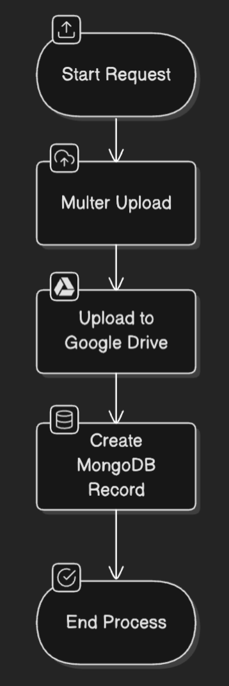

# Asset-Service

An asset-service capabale of hosting images, audio, or text-based files.

## Programmatic API Routes

To upload a file with category and folder parameters, use the following cURL command:

```bash
curl -X POST "/upload-file?category=:category&folder=:folder" \
  -H "Content-Type: multipart/form-data" \
  -F "asset=@/path/to/your/file" \
  -F "category=:category" \
  -F "folder=:folder"
```

To request the url of an an asset  
`GET /drive/asset/:assetId `

## Pipeline

The service uploads files to specific google drive folder. All files are downloaded to the service directory allowing them to have a public url to the asset/resource.


## Data

Files can be uploaded to the drive to a specific folder differentiated by category.
The home page offers actions such as downloading the entire drive or specific modules by category.
You can view all assets which will show you all assets currently living in the service and are ready to be used.

## Adding a New Folder to the Drive

The folder must be a child of either the "IMAGES", "AUDIO", or "JSON" folder. After adding a new folder to the drive, you are then able to use the `POST upload-file` route to upload files to it.
